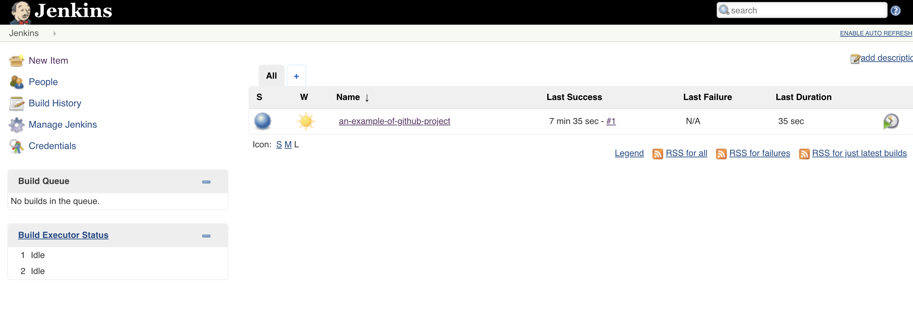
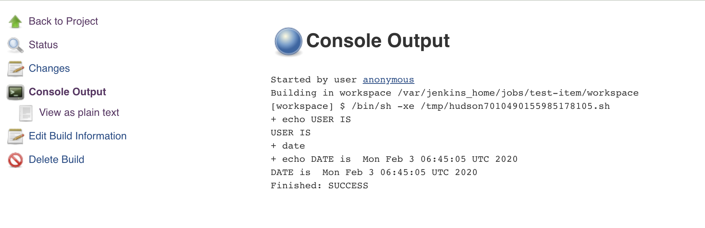

# Jenkins & Docker

In this example we will run Jenkins from a container.


## 1. Use a jenkins image

```Image in hub.docker.com:```
```https://hub.docker.com/r/ticketfly/jenkins-example-gradle-build```

```
# pull image
docker pull ticketfly/jenkins-example-gradle-build

# run container
docker run --name jenkins -p 8080:8080 -v /var/jenkins_home ticketfly/jenkins-example-gradle-build
```
<br>

```Access Jenkins in the browser: <public_ip>:8080```
<br>

Here's an image of the jenkins home page:




### 2. Use existing project

This Jenkins comes with a sample project, source code of which can be found at ```https://github.com/Ticketfly/jenkins-docker-examples```


1. Build the project
2. Check the test results
3. Configure and change something


### 3. Create a new Item
1. go to ```new item```
2. Enter a name, say ```test```
3. choose ```Freestyle project```
4. press ```ok```
5. Go to Build and ```Add build step```
6. choose ```Execute shell```
7. Add a shell code ```echo "USER IS $USER" ; echo "DATE is " `date````
8. Save and go to dashboard
9. Build
10. Go to ```console output``` and Test build result

